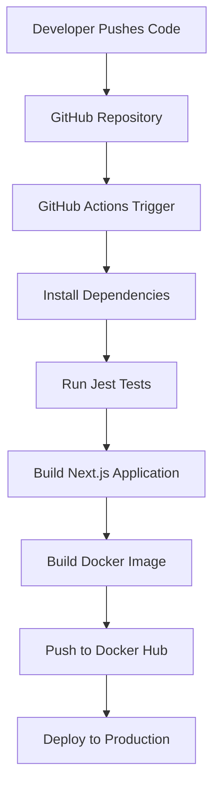

# 🚀 Production-Grade CI/CD Pipeline for Next.js

[](https://github.com/naveenprasanth0508/GithubAction_Unit_Testing/actions/workflows/integration.yml)
[](https://github.com/naveenprasanth0508/GithubAction_Unit_Testing/actions/workflows/deploy.yml)

---

## 📌 Project Overview

This project demonstrates the implementation of a modern CI/CD pipeline for a Next.js application using GitHub Actions.

The pipeline automatically validates code quality, executes automated tests, builds production-ready artifacts, creates Docker images, and deploys the application without manual intervention.

The primary goal is to showcase DevOps best practices, continuous integration, automated deployments, and containerized application delivery.

---

## 🎯 Objectives

- Automate application testing and validation
- Implement Continuous Integration (CI)
- Implement Continuous Deployment (CD)
- Build production-ready Docker images
- Ensure cross-version Node.js compatibility
- Reduce manual deployment effort
- Improve release reliability and consistency

---

## ✨ Key Features

### 🧪 Automated Testing
- Jest Unit Testing
- Automated test execution on every push and pull request
- Continuous validation of application functionality

### 🔄 Continuous Integration
- GitHub Actions workflow automation
- Multi-version Node.js testing
- Build verification before deployment

### 🏗️ Production Builds
- Optimized Next.js production builds
- Automated build validation
- Consistent deployment artifacts

### 🐳 Docker Integration
- Automated Docker image creation
- Containerized deployment workflow
- Docker Hub image publishing

### 🔐 Security
- GitHub Secrets management
- Secure credential handling
- Environment variable protection

---

## 🛠 Tech Stack

### Application
- Next.js
- React
- JavaScript / TypeScript

### DevOps & Automation
- GitHub Actions
- Docker

### Testing
- Jest

### Container Registry
- Docker Hub

---

## 🔄 CI/CD Workflow

### Continuous Integration (CI)

```text
Developer Push
       │
       ▼
GitHub Repository
       │
       ▼
GitHub Actions
       │
       ▼
Install Dependencies
       │
       ▼
Run Unit Tests
       │
       ▼
Build Verification
```

### Continuous Deployment (CD)

```text
Successful Build
        │
        ▼
Docker Image Build
        │
        ▼
Push to Docker Hub
        │
        ▼
Deploy Application
        │
        ▼
Production Environment
```

---

## 📊 Workflow Architecture



---

## 🧪 Testing Strategy

### Unit Testing
- Jest Framework
- Component Testing
- Function Testing

### Build Validation
- Production Build Verification
- Dependency Validation

### Compatibility Testing
- Node.js 18.x
- Node.js 20.x
- Node.js 22.x

---

## 📈 Benefits

- Faster release cycles
- Reduced deployment errors
- Automated quality assurance
- Improved developer productivity
- Consistent deployment process
- Production-ready delivery pipeline

---

## 🚀 Future Enhancements

- SonarQube Integration
- Security Scanning
- Kubernetes Deployment
- AWS ECS/EKS Deployment
- Slack Notifications
- Infrastructure as Code (Terraform)
- Automated Rollbacks

---

## 👨‍💻 Developed By

**Naveen Prasanth P**  
B.E. Computer Science and Engineering

---

⭐ *Automating software delivery through modern DevOps and CI/CD practices.*
